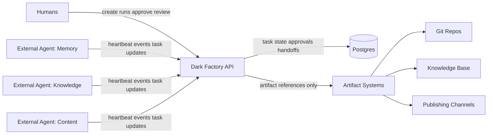
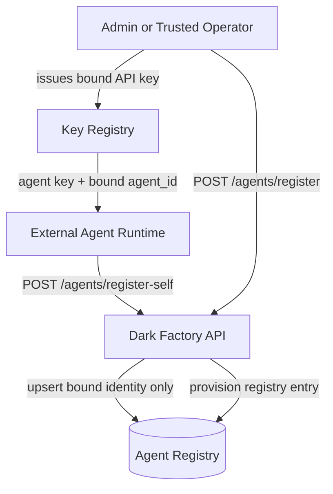
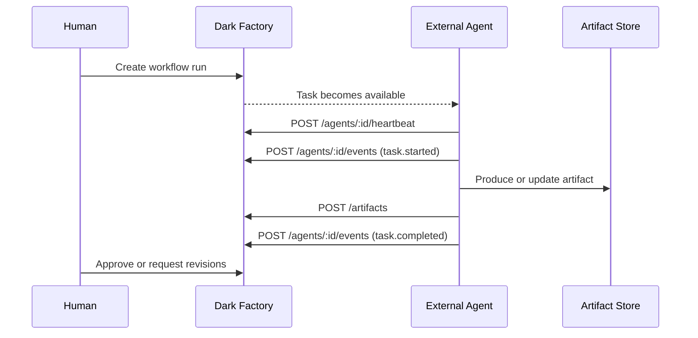

# dark-factory

Dark Factory is an API-first coordination layer between humans, external agents, and downstream artifact systems.

## System View



## Registry And Trust



## Runtime Activity Flow



## Agent Docs

- Activity broadcast implementation guide: [docs/agent-activity-broadcast.md](docs/agent-activity-broadcast.md)

## Agent Registry

- `POST /api/v1/agents/register` is admin-only and should be treated as provisioning
- `POST /api/v1/agents/register-self` is for trusted self-upsert after a key has already been issued
- self-registration must derive identity from the authenticated key binding, not request payload

## API Write Auth (Current)

All write requests to `/api/v1/*` (`POST`, `PUT`, `PATCH`, `DELETE`) require:

- header: `x-df-api-key: <your-key>`
- env var:
  - preferred: `DARK_FACTORY_API_KEYS_JSON` (multiple keys)
  - fallback: `DARK_FACTORY_API_KEY` (single legacy key, admin)

If no keys are configured, write APIs return `503` and are effectively disabled.

### Multiple key config

```bash
export DARK_FACTORY_API_KEYS_JSON='[
  {"key":"admin-local-1","role":"admin","label":"owner"},
  {"key":"human-review-1","role":"human","label":"editor"},
  {"key":"agent-memory-1","role":"agent","agent_id":"agent-memory","label":"memory-agent"},
  {"key":"agent-knowledge-1","role":"agent","agent_id":"agent-knowledge","label":"knowledge-agent"}
]'
```

Notes:
- Agent keys are bound to `agent_id` for writes under `/api/v1/agents/:agentId/*`.
- Agent keys are blocked from endpoints outside their role policy.

### Role policy (write endpoints)

- `admin`:
  - can write all `/api/v1/*` endpoints
- `human`:
  - can write: `/api/v1/tasks*`, `/api/v1/workflow-runs*`, `/api/v1/approvals*`, `/api/v1/artifacts`, `/api/v1/artifacts/:id/mark-approved`, `/api/v1/handoffs*`
  - cannot write: `/api/v1/agents/register`, `/api/v1/agents/:id`, `/api/v1/agents/:id/heartbeat`, `/api/v1/agents/:id/events`
- `agent`:
  - can write: `/api/v1/tasks*`, `/api/v1/artifacts`, `/api/v1/handoffs*`, `/api/v1/agents/:id/heartbeat`, `/api/v1/agents/:id/events`
  - cannot write: `/api/v1/approvals*`, `/api/v1/workflow-runs*`, `/api/v1/agents/register`, `/api/v1/agents/:id`
  - plus `agent_id` binding is enforced for `/api/v1/agents/:id/*`

### Example write call

```bash
curl -X POST http://localhost:3000/api/v1/tasks \
  -H "content-type: application/json" \
  -H "x-df-api-key: admin-local-1" \
  -d '{"title":"Draft post","task_type":"content.drafting"}'
```

### Example agent heartbeat call

```bash
curl -X POST http://localhost:3000/api/v1/agents/agent-memory/heartbeat \
  -H "content-type: application/json" \
  -H "x-df-api-key: agent-memory-1" \
  -d '{"status":"working","progress_pct":42}'
```
