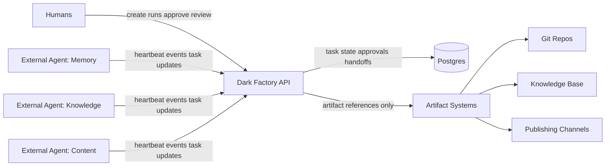
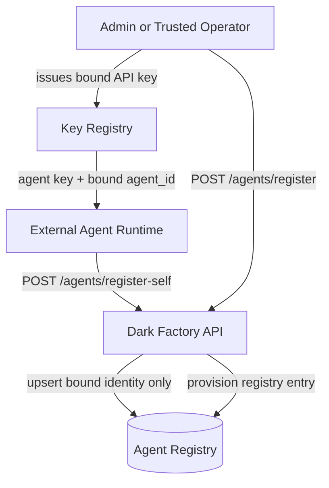
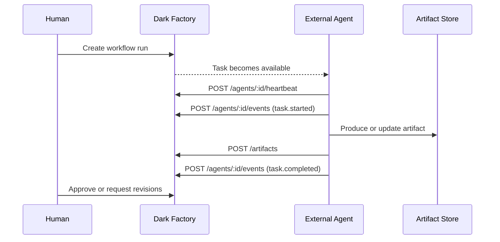

# dark-factory

Dark Factory is an API-first coordination layer between humans, external agents, and downstream artifact systems.

## Local Development

Run the Next.js app locally against the shared Railway Postgres instance:

```bash
npm install
npm run dev
```

Add a `.env.local` in the repo root with at least:

```bash
DATABASE_URL=postgresql://...
DARK_FACTORY_API_KEYS_JSON='[
  {"key":"admin-local-1","role":"admin","label":"owner"},
  {"key":"agent-memory-1","role":"agent","agent_id":"agent-memory","label":"memory-agent"}
]'
```

Optional Agent Mail integration vars:

```bash
AGENT_MAIL_URL=https://mcp-agent-mail-production-ae0a.up.railway.app/mcp/
AGENT_MAIL_BEARER_TOKEN=...
AGENT_MAIL_WEB_URL=https://mcp-agent-mail-production-ae0a.up.railway.app
AGENT_MAIL_PROJECT_KEY=/absolute/path/to/prism-coord
AGENT_MAIL_AGENT_MAP_JSON='{"agent-memory":"AmberOtter"}'
```

Or copy the checked-in example:

```bash
cp .env.example .env.local
```

Notes:
- local development should use the public Postgres URL, not Railway's internal `postgres.railway.internal` hostname
- deployed Railway services should use internal service URLs/variable references
- startup validates `DATABASE_URL`, API key JSON shape, and basic Agent Mail env coherence
- the homepage now includes a hidden entrance: knock three times on the door to reveal the `/runs` dashboard

## System View



## Registry And Trust



## Runtime Activity Flow



## Agent Docs

- Activity broadcast implementation guide: [docs/agent-activity-broadcast.md](docs/agent-activity-broadcast.md)
- The landing page is intentionally product-facing; the operator surface begins at `/runs`
- Future runtime skill draft: [docs/future-agent-runtime-skill-draft.md](docs/future-agent-runtime-skill-draft.md)
- Reusable content-agent skill: [skills/dark-factory-content-runtime/SKILL.md](skills/dark-factory-content-runtime/SKILL.md)
- Minimal two-agent content workflow walkthrough: [docs/minimal-content-workflow-e2e.md](docs/minimal-content-workflow-e2e.md)

### Installing And Using The Skill

The repo skill is stored in:

- [skills/dark-factory-content-runtime/SKILL.md](skills/dark-factory-content-runtime/SKILL.md)

To make it available to another Codex agent, copy or symlink the whole skill folder into that agent's Codex skills directory:

```bash
mkdir -p "$HOME/.codex/skills"
cp -R skills/dark-factory-content-runtime "$HOME/.codex/skills/dark-factory-content-runtime"
```

Or symlink it so updates in this repo stay live:

```bash
mkdir -p "$HOME/.codex/skills"
ln -s "$(pwd)/skills/dark-factory-content-runtime" "$HOME/.codex/skills/dark-factory-content-runtime"
```

After that, a Codex session can trigger it by:

- naming the skill: `dark-factory-content-runtime`
- or asking for the matching workflow explicitly, for example:
  - "check Agent Mail for Dark Factory content tasks and work the inbox-driven loop"
  - "use the Dark Factory content runtime skill for this workflow"

What the agent still needs at runtime:

- access to the `prism-coord` repo/workspace
- a bound Dark Factory API key
- `DATABASE_URL` if it is running the local app
- `AGENT_MAIL_URL`
- `AGENT_MAIL_BEARER_TOKEN`
- optionally `AGENT_MAIL_PROJECT_KEY` and `AGENT_MAIL_AGENT_MAP_JSON`

Recommended setup for a working agent:

1. install the skill into `~/.codex/skills`
2. give the agent access to the `prism-coord` workspace
3. provide the bound API key and Agent Mail env vars
4. tell the agent which workflow run or inbox/project it should operate on

The skill does not replace runtime provisioning. It standardizes behavior once the agent has access.

## Agent Registry

- `POST /api/v1/agents/register` is admin-only and should be treated as provisioning
- `POST /api/v1/agents/register-self` is for trusted self-upsert after a key has already been issued
- self-registration must derive identity from the authenticated key binding, not request payload

## API Write Auth (Current)

All write requests to `/api/v1/*` (`POST`, `PUT`, `PATCH`, `DELETE`) require:

- header: `x-df-api-key: <your-key>`
- env var:
  - preferred: `DARK_FACTORY_API_KEYS_JSON` (multiple keys)
  - fallback: `DARK_FACTORY_API_KEY` (single legacy key, admin)

If no keys are configured, write APIs return `503` and are effectively disabled.

### Multiple key config

```bash
export DARK_FACTORY_API_KEYS_JSON='[
  {"key":"admin-local-1","role":"admin","label":"owner"},
  {"key":"human-review-1","role":"human","label":"editor"},
  {"key":"agent-memory-1","role":"agent","agent_id":"agent-memory","label":"memory-agent"},
  {"key":"agent-knowledge-1","role":"agent","agent_id":"agent-knowledge","label":"knowledge-agent"}
]'
```

Notes:
- Agent keys are bound to `agent_id` for writes under `/api/v1/agents/:agentId/*`.
- Agent keys are blocked from endpoints outside their role policy.

### Role policy (write endpoints)

- `admin`:
  - can write all `/api/v1/*` endpoints
- `human`:
  - can write: `/api/v1/tasks*`, `/api/v1/workflow-runs*`, `/api/v1/approvals*`, `/api/v1/artifacts`, `/api/v1/artifacts/:id/mark-approved`, `/api/v1/handoffs*`
  - cannot write: `/api/v1/agents/register`, `/api/v1/agents/:id`, `/api/v1/agents/:id/heartbeat`, `/api/v1/agents/:id/events`
- `agent`:
  - can write: `/api/v1/tasks*`, `/api/v1/artifacts`, `/api/v1/handoffs*`, `/api/v1/agents/:id/heartbeat`, `/api/v1/agents/:id/events`
  - cannot write: `/api/v1/approvals*`, `/api/v1/workflow-runs*`, `/api/v1/agents/register`, `/api/v1/agents/:id`
  - plus `agent_id` binding is enforced for `/api/v1/agents/:id/*`

### Example write call

```bash
curl -X POST http://localhost:3000/api/v1/tasks \
  -H "content-type: application/json" \
  -H "x-df-api-key: admin-local-1" \
  -d '{"title":"Draft post","task_type":"content.drafting"}'
```

### Example agent heartbeat call

```bash
curl -X POST http://localhost:3000/api/v1/agents/agent-memory/heartbeat \
  -H "content-type: application/json" \
  -H "x-df-api-key: agent-memory-1" \
  -d '{"status":"working","progress_pct":42}'
```

## Agent Mail Integration

Dark Factory mirrors task lifecycle updates into Agent Mail without making Agent Mail the source of truth for task state.

Current behavior:
- task `claim`, `start`, `block`, and `complete` send a mirrored Agent Mail message
- `start` can create file reservations when `file_paths` are supplied
- `block` and `complete` release file reservations for supplied paths
- `POST /api/v1/agents/:agentId/events` also writes a `task_events` row when `task_id` is present

Conventions:
- workflow thread id: `run-<workflow_run_id>`
- message subject prefix: `[task:<task_id>] ...`
- reservation reason: `task:<task_id>`

## Checklist

Current focus:
- validate the content workflow path end to end before expanding into software-delivery or PR-driven flows
- keep `prism-coord` as the control plane and Agent Mail as the communication plane
- use the current content templates and agent roles as the main dogfood scenario

Completed:
- [x] Provision Railway Postgres and apply the initial schema
- [x] Rename repo schema layout from `supabase/migrations` to `db/migrations`
- [x] Add seed data under `db/seeds`
- [x] Build the first Postgres access layer under `lib/db`
- [x] Implement DB-backed read routes for runs and tasks
- [x] Implement authenticated write routes for agent registration, heartbeat, events, and task lifecycle transitions
- [x] Persist `task_events` during task transitions
- [x] Mirror agent events into `task_events` when `task_id` is present
- [x] Deploy `prism-coord` on Railway
- [x] Deploy `mcp-agent-mail` on Railway with persistent mounted storage
- [x] Wire `prism-coord` to Agent Mail with mirrored task messages and file reservations
- [x] Normalize Agent Mail thread ids and stable agent-name mapping
- [x] Port the themed landing page assets and add the hidden door entrance to `/runs`
- [x] Add workflow template listing and workflow run creation from the API
- [x] Add a minimal workflow-run creation UI on `/runs`
- [x] Materialize seeded workflow templates into tasks and task dependencies
- [x] Implement handoff persistence and task-scoped handoff reads
- [x] Add handoff creation and handoff history in the task drawer
- [x] Add a dedicated task event/activity view in the task drawer
- [x] Show Agent Mail thread summary, unread counts, and reservation conflicts on runs/tasks surfaces
- [x] Add Agent Mail project/thread links to run and task surfaces
- [x] Expand workflow run update flow with a run controls panel on `/runs`
- [x] Expand workflow run creation beyond the minimal panel with initial status selection and template task previews
- [x] Establish `owner_agent_key` as the current template-routing convention in seeded content templates
- [x] Add startup env validation and a checked-in `.env.example`
- [x] Add automated tests for workflow creation, handoffs, task events, and task transition routes
- [x] Draft the future inbox-driven agent runtime skill in [docs/future-agent-runtime-skill-draft.md](docs/future-agent-runtime-skill-draft.md)
- [x] Turn the future agent runtime draft into a reusable repo skill at [skills/dark-factory-content-runtime/SKILL.md](skills/dark-factory-content-runtime/SKILL.md)

Next:
- [ ] Add richer task-level operator actions beyond the current read-heavy drawer and handoff form
- [ ] Evolve workflow template routing beyond the current `owner_agent_key` convention into role/capability-aware routing
- [ ] Add richer env validation around Railway/local mode assumptions if local onboarding stays rough
- [ ] Decide whether to keep the current best-effort Agent Mail fire-and-forget behavior or move mirroring into a domain service/queue
- [ ] Tighten Agent Mail auth/production hardening beyond the current bearer-token setup, using [docs/agent-mail-hardening-notes.md](docs/agent-mail-hardening-notes.md) as the baseline
